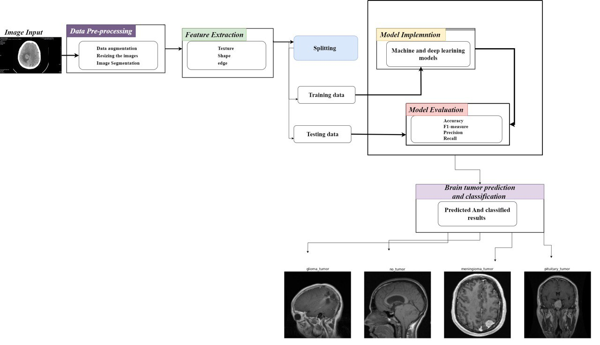

# Imaging-based Machine Learning for Brain Tumor Prediction

This repository contains the implementation of our senior project **"Imaging-based Machine Learning for Brain Tumor Prediction"**, developed as part of the requirements for the **BS in Data Science** at the **University of Jeddah**. The project aims to assist in the early detection, diagnosis, and classification of brain tumors using advanced machine learning and deep learning techniques on MRI image data.

---

## Table of Contents

- [Overview](#overview)
- [Project Objectives](#project-objectives)
- [Dataset](#dataset)
- [Methodology](#methodology)
- [Models Implemented](#models-implemented)
- [Results](#results)
---

## Overview

Accurate and early diagnosis of brain tumors is crucial for effective treatment and improving survival rates. Traditional diagnostic methods are time-consuming, subjective, and prone to human error. By leveraging **machine learning (ML)** and **deep learning (DL)** techniques, this project aims to automate the process of brain tumor detection and classification using MRI images.

**Key Features:**
- Predict the presence or absence of brain tumors.
- Classify tumor types, such as **Glioblastoma**, **Meningioma**, and **Pituitary Tumor**.
- Improve diagnostic accuracy using advanced ML/DL techniques.

---

## Project Objectives

1. **Review Existing Models**:
   - Analyze previous studies on brain tumor prediction using machine learning.
   - Identify the most accurate machine learning and deep learning models.

2. **Data Preprocessing**:
   - Prepare and preprocess MRI datasets for training and evaluation.
   - Apply techniques such as grayscale conversion, resizing, and feature extraction.

3. **Model Development**:
   - Implement multiple machine learning and deep learning models, including:
     - **Support Vector Machines (SVM)**
     - **Convolutional Neural Networks (CNNs)**
     - **ResNet101**
     - **EfficientNetB3**

4. **Optimization**:
   - Fine-tune model parameters to achieve maximum accuracy.
   - Minimize false positives and false negatives.

---

## Dataset

### Source:
The dataset used for this project consists of MRI images of brain tumors. The dataset was retrieved from **Kaggle** and includes labeled images for different tumor types.

### Classes:
- Glioma
- Meningioma
- Pituitary Tumor
- Healthy (No Tumor)

### Preprocessing Steps:
- Grayscale conversion
- Resizing images to uniform dimensions
- Image augmentation (dilation, thresholding, etc.)
- Feature extraction using advanced techniques

---

## Methodology

We followed the **Data Science Life Cycle Methodology**, which includes the following steps:
1. **Data Collection**: Collect MRI images from publicly available datasets.
2. **Data Preprocessing**: Normalize, resize, and augment the data for consistency.
3. **Model Building**: Train, validate, and test multiple machine learning and deep learning models.
4. **Performance Evaluation**: Evaluate models using metrics such as accuracy, precision, recall, and F1-score.
5. **Optimization**: Fine-tune models through hyperparameter tuning and cross-validation.

   

---

## Models Implemented

- **Machine Learning Models**:
  - Logistic Regression
  - Support Vector Machines (SVM)

- **Deep Learning Models**:
  - Convolutional Neural Networks (CNN)
  - ResNet101
  - EfficientNetB3

Each model was trained, validated, and tested on the preprocessed dataset. Performance metrics were recorded for comparison.

---

## Results

The table below summarizes the accuracy achieved by each model:

| Model                  | Accuracy (%) |
|-------------------------|-------------|
| Support Vector Machines | 97          |
| ResNet101              | 58          |
| EfficientNetB3         | 99          |

**Key Insights:**
- The **EfficientNetB3** model achieved the highest accuracy (99.6%), making it the most effective for brain tumor classification.
- SVM performed well among traditional machine learning models, with an accuracy of 90.7%.

---
